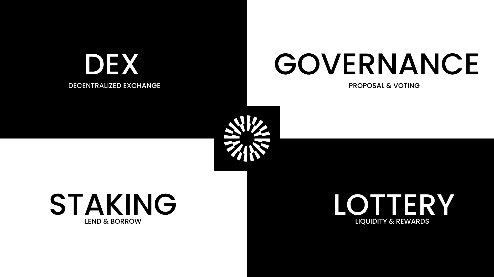

# MantleSwap

## 😃 Intro

---

MantleSwap is a Uniswap V2 port for the Mantle Network, a Layer 2 scalability solution built on top of Ethereum that aims to increase transaction throughput beyond traditional L2s while minimizing trust risk. So we built a Swap - the first with Governance & Staking.

## 🪙 MTL - Mantleswap Token

---

First of all, Mantleswap has its own governance token called `MTL`. This token will be used to vote on proposals for the platform, and also for liquidity providers to earn a share of the fees generated on the platform.

## 💱 DEX

---

One of the primary features of Mantleswap is its DEX where users can swap one token for another, all while maintaining the security and transparency of a decentralized exchange.

## 🏛️ Governance

---

Lastly, the governance feature on Mantleswap allows users and community members to create proposals which can then be voted on by other community members who hold enough governance tokens. This provides a democratic way for the community to make decisions about the platform's future direction and helps to ensure that it is serving the needs of its users.

## 💰 Lottery

---

The Lottery is an inspiration from Pancakeswap Lottery.
The prizes for each lottery round come from three sources:
Test the Lottery SCs :
https://explorer.testnet.mantle.xyz/address/0x665d834a05eaaCB8cAB97192FA23A72653E90ABF/write-contract#address-tabs

### Ticket Purchases

100% of the BIT paid by people buying tickets that round goes back into the prize pools.

### Rollover Prizes

After every round, if nobody wins in one of the prize brackets, the unclaimed BIT for that bracket rolls over into the next round and are redistributed among the prize pools.

## ⚗️ Liquidity Pools

---

Another key feature of Mantleswap is its liquidity pool creation functionality. Users can provide liquidity to the platform, which helps to increase the overall liquidity of the platform and earn a share of the fees generated on trades made on their specific pool.

## 🥞 Staking

---

Lastly, Mantleswap has also added lending and borrowing capabilities. Lenders can lend their extra BIT tokens to the protocol and in return receive governance tokens as rewards. Borrowers can borrow funds as loans which need to be paid back within 6 EMIs. This provides a new avenue for those who are looking to earn passive income on their crypto holdings or for those who are in need of a loan.

---

> Overall, Mantleswap is an exciting project that offers a range of features and benefits for crypto traders and enthusiasts.
> We hope you'll consider checking it out and joining the Mantleswap community.

## Thank you!

## ℹ️ Deployed at

`https://mantleswap-6f0593.spheron.app/`
